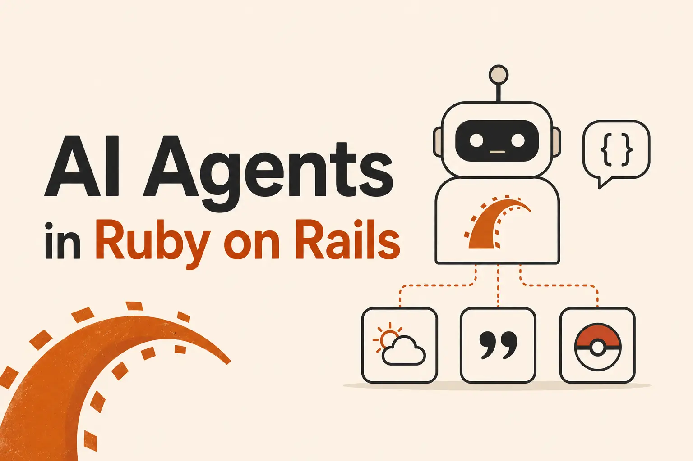

I had to make an agent at my work. RubyLLM looked simple, so I built [a prototype][repo_link] before adding the gem to the main application.



## Application Setup

First I scaffolded a minimal rails app.

```sh
rails new rails_agent_prototype --minimal --skip-active-record
```

With this, functionalities like Active Record, queues, and mailers were skipped.

Then I added the ruby_llm gem and its initializer.

```rb
RubyLLM.configure do |config|
  config.openai_api_key = ENV["OPENAI_API_KEY"]
  config.default_model = ENV["OPENAI_MODEL"]

  # config.ollama_api_key = ENV['OLLAMA_API_KEY']
end
```
We can use any provider by adding their API keys to the `.env` file.

After that, I created tools that the agent could use.

## Tools

Tools are functions that agents can execute to perform tasks.

Here is an example of a Pokemon tool that fetches data based on Pokemon name or Pokedex number.

```rb
module Tools
  class PokemonTool < RubyLLM::Tool
    desc "Look up a Pokemon by name or ID. Returns name, types, abilities, stats, and sprite."

    param :name_or_id,
      type: "string",
      desc: "The Pokemon name (e.g. 'pikachu') or Pokedex number (e.g. '25')",
      required: true

    def execute(name_or_id:)
      client = HttpClient.new(base_url: "https://pokeapi.co/api/v2")
      data = client.get("/pokemon/#{name_or_id.to_s.downcase}")

      format_pokemon(data)
    rescue HttpClientError => e
      if e.status == 404
        "Pokemon '#{name_or_id}' not found."
      else
        "Error fetching Pokemon data: #{e.message}"
      end
    end

    private

    def format_pokemon(data)
    end
  end
end
```

The agent doesn't need to know how a tool is implemented. It only needs to know what the tool does and what inputs it accepts. Based on the user's request, the agent can decide whether to invoke the tool.

### Test the tool

Tools are regular functions, so we don't need to wait to create an agent to call the tool. We can execute the tool from Rails console.

```sh
chat = RubyLLM.chat
chat.with_tools(Tools::PokemonTool.new)
chat.ask("tell me about Pikachu?")
```

Now that we have tools, let's see how to make an agent that can use them.

## Agent

An LLM with tools is an agent. An agent can iteratively use those tools to complete a task.

We can define an agent in RubyLLM like this.

```rb
module Agents
  class Assistant < RubyLLM::Agent
    instructions "You are a helpful assistant. Based on the user's request, use the available tools to fetch information or perform actions."

    tools ::Tools::PokemonTool, ::Tools::WeatherTool, ::Tools::QuoteTool

    def initialize(...)
      super
    end
  end
end
```

We pass instructions and tools to the agent, and RubyLLM handles the agent loop and retries for us.

## Test the Agent

In the console, we can instantiate the agent and ask it a question.

```rb
Agents::Assistant.new.ask('tell me a random quote, and paraphrase it like the pokemon number 8 is saying it.')
```

```txt
Original quote:
"I will prepare and some day my chance will come." — Abraham Lincoln

Wartortle (Pokemon #8) style rewrite:
"Patience flows like the tide. I train beneath the waves, and when the tide turns, my moment will surface."
```

The agent used the quote and pokemon tools to fetch data and then rewrote the quote as if Wartortle had said it.

## Final Thoughts

In this prototype, we made tools and an agent. RubyLLM made working with agents simple. It's now my go-to gem for implementing AI features in the ruby ecosystem.

[repo_link]: <https://github.com/hokageCV/rails_agent_prototype>
