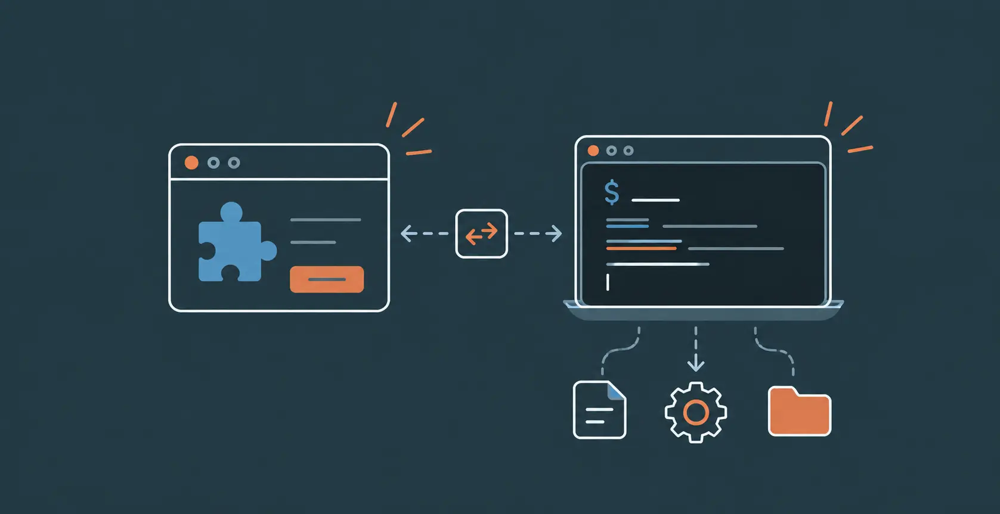

I was reading a [blog][source_blog] from Sean Goedecke where I came across the term 'native messaging'. I hadn't heard about it before, so I started reading about it.

I realized it could improve one of my workflows.

## The Old Workflow

I have a browser [extension][collector_repo] that collects blogs and newsletters in one file. I then export the file and convert it into `.azw3` format using [calibre][calibre]. This way, I can read those blogs in my kindle.

Yes, there are existing services that can send articles to kindle. But they don't fit my workflow
- They send them over email, and I keep my kindle offline all the time
- They send the articles individually, not in a single file

For that reason ~~I am out~~ I made the extension.

## The Problems

These are the problems to consider updating the workflow

1. Once the extension's popup is closed, its running processes are stopped
    - This means we can't have long running tasks in it
2. The extension can't access the system programs

Let's see how we can handle these.

##  Native Messaging

First, let's understand a bit about native messaging.

### What is it?

Native messaging allows extensions to communicate with applications installed in the system.

### Prerequisites

These are the prerequisites to use native messaging.

#### Extension Manifest

In the manifest file of the extension, it must ask for `nativeMessaging` permission.

```json
"permissions": [ "nativeMessaging" ],
```

#### Host Manifest

We also have to add a host manifest.

```json
{
  "name": "com.thecollector.converter",
  "description": "The Collector native conversion host",
  "path": "__HOST_PATH__",
  "type": "stdio",
  "allowed_origins": [
    "chrome-extension://__EXTENSION_ID__/"
  ]
}
```

- `path` is the path to the executable file that can be run via the extension
- `type: stdio` tells the browser to communicate with the host via standard input & output channels
- `allowed_origins` contains the extension ids that are allowed to communicate with the host

The file is added to the config directory of the browser in which extension is installed.

### How it works?

Here's an overview of how native messaging works

1. Extension sends a message
2. Browser checks the prerequisites
   <ol type="a">
    <li>Extension has nativeMessaging permission</li>
    <li>Name is registered</li>
    <li>And the ID matches</li>
   </ol>
   <ul>
    <li>If any of these fails, no process is spawned.</li>
   </ul>
3. Browser spawns a process with stdio channels
4. Browser writes request to stdin. The host reads it and runs the handler for that message
5. The host writes response into stdout, and exits
6. Browser reads the response

## The Solution

Now let's see how we can handle the above two problems.

For the first problem, we will use service workers. They can continue working in background even when the popup is closed.

For the second problem, we will use native messaging. We will put the commands that we want to execute in the host's handlers. From the extension, we send a message containing the action we want the host to perform.

### The New Workflow

Now I export from the extension, and get a `.azw3` file in my system. Behind the scenes, this is what happens

- Extension initiates the download
- Service worker listens for download completion
- On completion, service worker sends message via native messaging
- Browser validates the native messaging configuration and passes the message to the host process
- Host receives the message and executes the action
- After conversion, host sends a success message to the extension and it's state is cleared

![A software architecture diagram detailing communication between a web browser extension and an external system host. Inside the main "Browser" container, an orange-bordered "Extension" box contains a "Popup" component that passes a "download ID" downward to a "Service Worker." The Service Worker communicates via angled lines with an adjacent orange-bordered "Internal Browser Processes" container, including an arrow to trigger a "clear state" action. The Browser container communicates externally with a "System" container enclosing a "Host" component, utilizing parallel horizontal arrows labeled "convert message" (outbound) and "convert success" (inbound).](./flow.webp)

## Conclusion

This is a small quality of life improvement, but an interesting one.

[source_blog]: <https://www.seangoedecke.com/deckard/>
[docs]: <https://developer.chrome.com/docs/extensions/develop/concepts/native-messaging>
[collector_repo]: <https://github.com/hokageCV/the-collector>
[calibre]: <https://calibre-ebook.com/>


