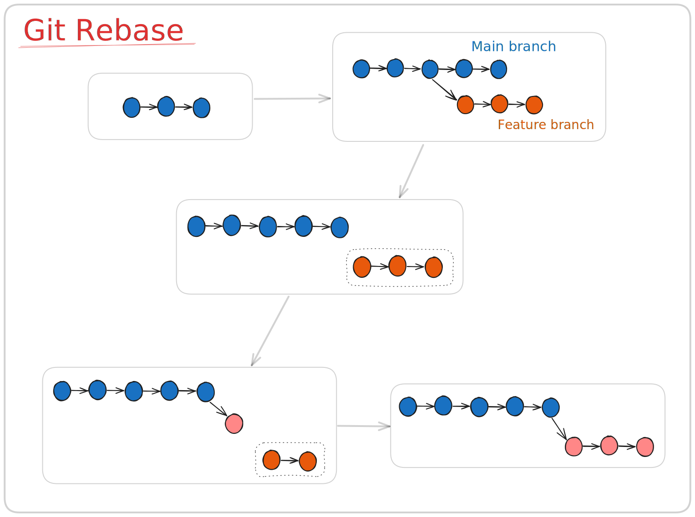

[image_source_page]: https://imgur.com/gallery/eye-of-agamotto-is-time-stone-Eijxi


With time stone, Dr Strange can alter reality. With `rebase`, you can alter reality, though it only alters history of your git repository.

In this article, we'll look at what `rebase` is, how it works and how to use it.

## Syntax

```bash
git rebase <base-branch>
```
This command changes the starting point (base) of your current branch to the specified branch.

## Why Rebase instead of Merge

The most common use case for rebase is to get the latest changes of the base branch into your feature branch.

Suppose you started working on an issue. You created `feature` branch from `main` branch. After some time, `main` got new commits by other developers.

Now to get those commits, you would

1. Go to base branch and get the updates from remote to local
```bash
 git pull origin main
```

2. Then go to feature branch and rebase:
```bash
git rebase main
```

This way, you less likely to get any conflicts while raising a pull request (since you would have already fixed them while rebasing). And will have a linear git history.

When we merge to get latest changes of base branch into current branch, we get extra 'merge commits'. These could be avoided by rebase.

## How rebase works



Now that we understand why rebase is useful, let's see what git actually does while rebasing:

1. Puts your commits in a temporary area
2. It then updates current branch to match the base branch
3. And then one by one, adds your commits on top of updated branch
4. If there is any conflict while adding a commit, then we have to fix it and add the files to staging area. After that we continue rebase
```bash
git rebase --continue
```
Note: Although the content of the commit is same, each reapplied commit is a new commit, resulting in a different commit hash.

## Avoid common pitfalls

- **Don't rebase in shared branches**: Rebase only in your own branch. Otherwise, it could cause problems for people who were working based on that previous history
- **Force push**: In case you had pushed commits to remote before rebase, then you will have to force push
  - At that point avoid `--force` as it could cause irreveraible changes
  - Instead use `--force-with-lease` which ensures that you don't overwrite others' commits, by verifying that no one else has pushed changes since your last pull

### Undo rebase with reflog

In case any commits are lost or you want to undo the rebase, then you can use `git reflog`

Reflog, short for reference log, tracks changes to HEAD in your local repository. Using these logs, we can revert our branch to its previous condition

For example, these are the reflog after feature branch was rebased with main branch.

```bash
df3a1a1 (HEAD -> feature) HEAD@{0}: rebase (finish): returning to refs/heads/feature
df3a1a1 (HEAD -> feature) HEAD@{1}: rebase (pick): feature commit 2
231d8fc HEAD@{2}: rebase (pick): feature commit 1
0f4b92f (main) HEAD@{3}: rebase (start): checkout main
a73d641 HEAD@{4}: checkout: moving from main to feature
0f4b92f (main) HEAD@{5}: commit: commit b
06cfab3 HEAD@{6}: commit: commit a
fa670ea HEAD@{7}: checkout: moving from feature to main
a73d641 HEAD@{8}: commit: feature commit 2
1961335 HEAD@{9}: commit: feature commit 1
fa670ea HEAD@{10}: checkout: moving from main to feature
fa670ea HEAD@{11}: commit: commit 3
```
There are rebase commits and before them, there is a '_checkout: moving from ..._'. This is the commit before rebase started.

Move the HEAD to that commit, ie reset the state of branch to that state.

```bash
`git reset --hard <commit-id>`
```

Thats it! Now your branch will be back to the state before the rebase.

## Conclusion

Rebase is a very powerful command that can make project history cleaner. But before using it in a shared repository, practice and understand it in your personal repository to avoid any data loss.
