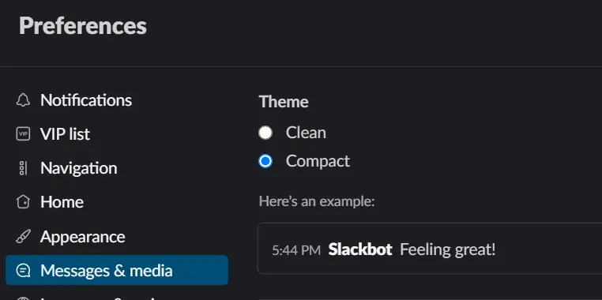
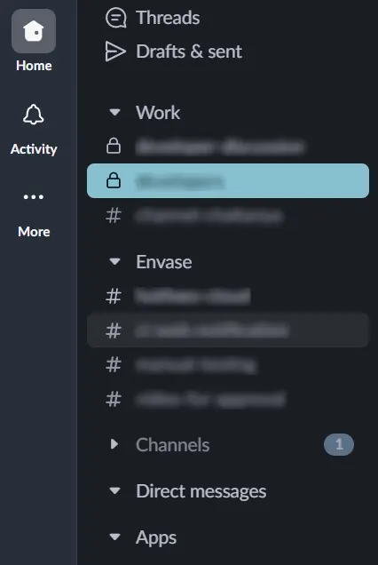

Slack is great for team communication, but its notifications can pile up quickly and make it hard to focus. I used to struggle with all the noise myself, but over time, I found a few simple ways to cut out distractions and stay productive.

In this post, I’ll share the tips I use to make Slack work better for me.

## Notifications

- Default Sound
  - The default notification sound, Knock Brush, plays two tones, which I find distracting. I replaced it with 'Ta-da', a single tone. This made a big difference — it was an instant upgrade to my focus.
- Flash Window
  - Flash windows are those message previews that pop up over your screen when someone messages you.
  - I keep it to 'never' so that they don't interrupt the deep work (a habit that I am cultivating).
- Mute Notifications
  - I mute channels that don’t require my immediate attention—like team-wide discussions or channels for specific projects I’m not actively working on.
  - This helps me stay focused during the day while still being able to check muted channels when needed.

## Display

- Compact Theme
  - 
  - `Preferences` > `Messages & media` > `Theme`
  - Compact Theme reduces visual clutter by removing profile pictures and displaying only usernames next to messages, making it easier to scan through messages quickly.

- Channel Sections
  - 
  - Slack allows you to organize your channels into custom sections. I’ve created three sections:
    - **Active Channels**: These are the channels I use daily and have notifications enabled.
    - **Occasional Channels**: Channels I check at specific times of the day, like for recurring tasks or event updates.
    - **Muted Channels**: Channels I don’t need to monitor frequently, but I keep them muted so I can check them when something important comes up.
      - Here, I have also enabled 'Show Unreads only' so that I only see the required channels, instead of list of all channels.

## Message

- One-click Reactions
  - 
  - `Preferences` > `Messages & media` > `Show one-click reactions`
  - I use certain reactions frequently. With this setting, I don’t have to open the emoji panel each time—I can just click once and keep moving.

- Start at newest message
  - `Preferences` > `Mark as read` > `Start me at the newest message, and mark the channel read`
  - By default, Slack shows unread messages first when you open a channel. I prefer starting at the newest message instead. This way, I skip over older messages that don’t need my attention, and I can scroll up if I need to catch up on anything.

- Markdown Formatting
  - `Preferences` > `Advanced` > `Input options` > `Format messages with markup`
  - This is one of my favorite settings. Slack’s default formatting toolbar feels slow to me, so I use markdown to quickly format messages.
  - Proper formatting helps me organize my thoughts more clearly and makes messages easier to understand for everyone, saving time for everyone involved.
  - For this, I use:
    - `[some text](link)` for hyperlinks
    - `*bold text*` for **bold text**
    - `_italic text_` for _italic text_
    - `-` for bullet points
    - ```  `text`  ```  for inline code highlights
- Threads
  - With threads, I can check recent messages across channels in same place
  - This saves time of navigating to individual channels and then searching for particular chat.

## Conclusion

We can’t eliminate all the noise, but with a few simple changes, we can create a more focused and productive workspace. Try these adjustments and see if they help improve your workflow.

## Further Readings

- https://womanonrails.com/slack-keyboard-shortcuts
