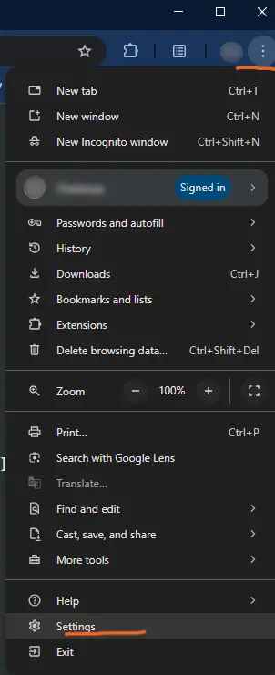
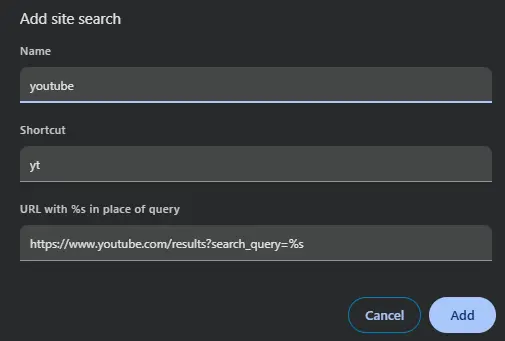

When browsing the internet, we often return to the same websites—like YouTube, Tailwind Docs, or looking up the meaning of a word.

Typically, we open a new tab, go to the website, and enter our query. With site search, we can reduce these three steps into one.

It is a shortcut by which we can directly enter query from the address bar and get results inside the website.

## How to set up Site Search

We can enable site search in the following way:

1. From the options, go to settings
  - 
2. In the side bar, select search engine
3. In the site search section, click the **Add** button
  - 
  - Give name for the shortcut
  - Shortcut you want to use
  - URL

#### How to get the URL

To get the search URL, first search for something on the website.

For example, if you search 'haikyuu' on YouTube, the URL in the address bar will become `https://www.youtube.com/results?search_query=haikyuu`. Now, replace  'haikyuu' with `%s` to make it dynamic `https://www.youtube.com/results?search_query=%s`. That's it!

## Usage

Now, you can type `yt` in address bar, enter query and results will directly open in youtube.

One shortcut that I frequently use is `mn` for searching the meaning of any word. Another one is `cf` for searching the confluence documentation in my workplace.

Give site search a try with your most-visited websites and see how much time it saves you. Once you get the used to it, you’ll wonder how you ever browsed without it!

