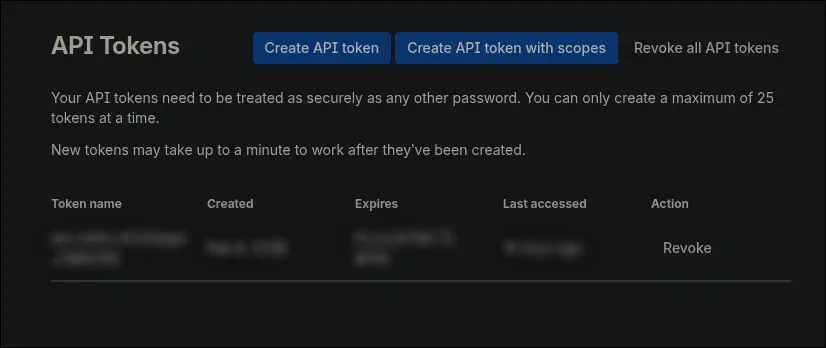
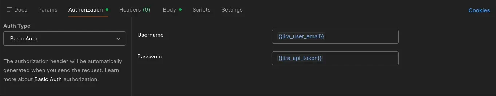

Recently I got a task for which I had to create 11 Jira issues.

Using Jira even for one issue feels laggy & slow. Click a button, add description, update few dropdowns and wait for the form to submit. And then repeat the process ten more times. This would be super slow. I decided to automate it with Jira API.

Here's how to create multiple issues in a single request using Jira API.

## Create API Token

Before making any requests to the API, we need an API token.

Follow the steps to create a token:
- Go to settings of your account
- Then to security tab
- Select 'Manage API tokens'

Or simply go to this link: <https://id.atlassian.com/manage-profile/security/api-tokens>.

In the page, click on 'create API token' button. In the popup, add token name and set expiration date.



Now we can use this token to make authenticated requests to the API.

## Using the Token

I will use [postman][postman] to send requests.

Set three variables:

- `jira_base_url`: Organization's URL
- `jira_user_email`: Your email
- `jira_api_token`: Token that you created

### Authentication

We will use the basic authentication method. Select `Basic Auth` in authenticaiton type and put jira_user_email for username & jira_api_token for password.



Postman will now include the Authorization header automatically.

### Bulk Issue Creation

To create multiple issues in one request, send a POST request to `{{jira_base_url}}/rest/api/3/issue/bulk`.

The payload expects to have an `issueUpdates` array that contains a `fields` object for each issue. In the fields object, the three required keys are project, summary & issuetype.

```json
{
  "issueUpdates": [
    {
      "fields": {
        "project": { "key": "PROJ" },
        "summary": "doctor doofenshmirtz plan",
        "issuetype": { "name": "Task" }
      }
    }
  ]
}
```

But usually we have other fields as well which are not present by default in jira. We can't use their frontend names in API. Jira refers to those fields using internal IDs like "customfield_10054".

### Fetch issue details

To find the internal IDs, we need to get details of an existing issue. We will use _get issue_ endpoint which has this URL: `{{jira_base_url}}/rest/api/3/issue/<issue-key>`

In the response body, we will get IDs with their frontend name and value. With this, we can make the bulk issue creation request.

Suppose we have to create two issues in the project with key 'PROJ', then the body would be as follows.

```json

{
  "issueUpdates": [
    {
      "fields": {
        "project": { "key": "PROJ" },
        "summary": "summary 1",
        "description": "desc 1",
        "issuetype": { "name": "Task" },
        "priority": { "name": "High" },
        "assignee": {
          "accountId": "712016:7ee833c8-5114-4e56-95fd-3a49ccc70266"
        },
        "customfield_10054": { "value": "Optimizations" },
        "customfield_10020": 364
      }
    },
    {
      "fields": {
        "project": { "key": "PROJ" },
        "summary": "summary 2",
        "description": "desc 1",
        "issuetype": { "name": "Task" },
        "priority": { "name": "High" },
        "assignee": {
          "accountId": "712017:7ee833c8-5115-4e56-95fd-6a52ccc70264"
        },
        "customfield_10054": { "value": "Optimizations" },
        "customfield_10020": 365
      }
    }
  ]
}
```

That's it! Issues will be created and we will get details for all the created issues in response.

## Conclusion

The API makes using Jira easier. Since then, I have created multiple scripts with the API to minimize my Jira UI usage. Like script for commenting or updating status of multiple issues at once. Try the API yourself, it might improve your workflow.

[postman]: <https://www.postman.com>
